Title: Setting up Team Viewer 
Date: 2023-06-07
Category: Misc 
Tags: team viewer, remote connection

# Overview
My sister needed some help connecting to a remote machine, this is what I did to get team viewer set up

# Create an account
In order to use the software a free account is required.  The free tier allows remotely controlling up to 3 devices.

- Navigate to the teamviewer website [https://www.teamviewer.com/en-us/](https://www.teamviewer.com/en-us/)
- Click **Sign in** on the upper right hand of the screen and select **Mangement Console**
- On the Management Console screen, click the **Sign Up** button under the words *New to TeamViewer?*
- Enter an email address, password, click the buttons and create a teamviewer account
- Note this info as you'll need it later
- Finally navigate to your email account and confirm the account from the email you received.

NOTE: If you have a google or microsoft account, you could use those instead.  If you did that though, if you get locked out of either account, you're also locked out of remotely accessing your team viewer account.

# Software Download and Configuration
Here's the software to be downloaded for each system

## URL
The following URL is for the MS Windows OS.  If you're downloading for another OS, use the appropriate link on this page.
[https://www.teamviewer.com/en-us/download/windows/](https://www.teamviewer.com/en-us/download/windows/)

For both the local and remote system, use the same software

**TeamViewer Full Client - x86-64**

**NOTE**: This assumes both computers were built within the last 10 years and are using modern OS's

## Controlling System Setup 
### Installation
On the device that's going to connect to another computer, download the install file and double click on it.

Select **Default installation** and click **Accept-next**

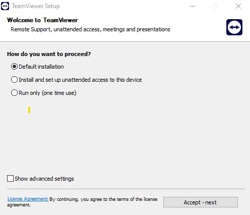

You'll get a Windows pop up asking if you want to make changes to the system, click **Accept**.

Click the check box to accept the EULA and DPA and then select **Continue**

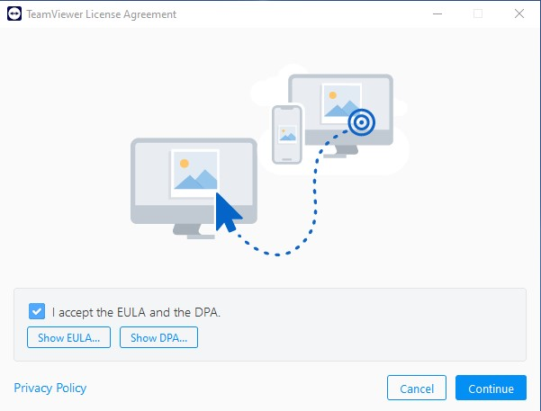

The software is set up on the main machine.
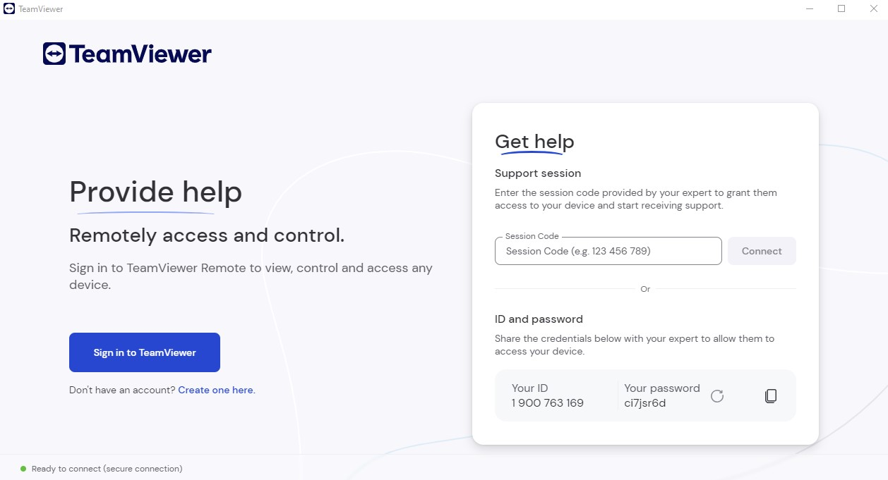

### Software Login
You will be prompted to log into an account to be able do anything.  Log in with your account.
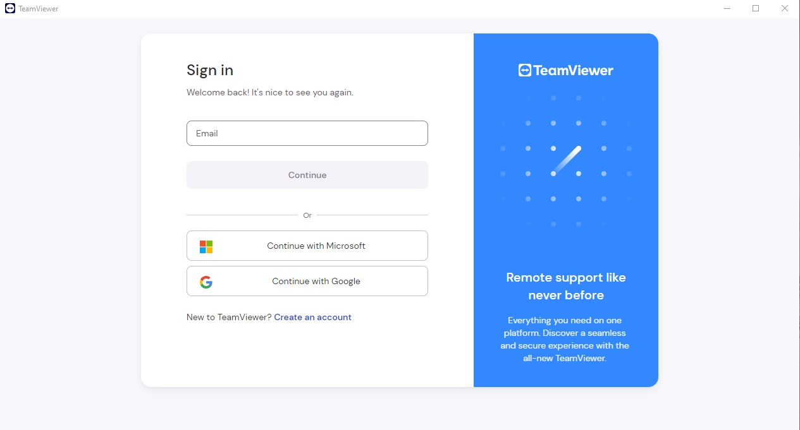

## Controlled Device Software Install 
This section covers how to install the software on the device you want to remotely manage.

Download the same software you used on the client setup
**TeamViewer Full Client - x86-64**

Next select *Install and set up unatteneded access to this device* and then select **Accept-next** to continue
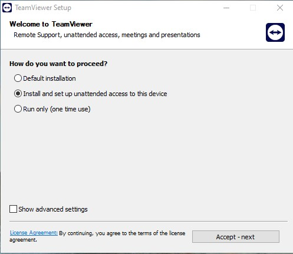

Select **Yes** to make changes at the Windows System prompt.

Watch watch the software install.

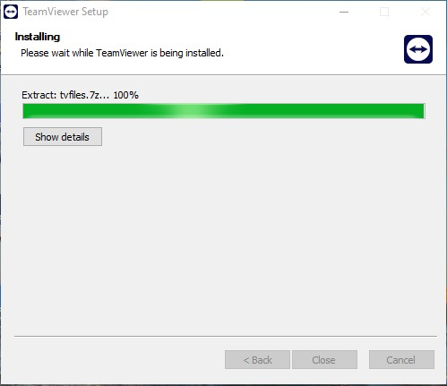

Click the checkbox and accept the EULA and then click **Continue** 

Click the **Sign In** button and then enter your credentials

Now you will be prompted that you need to check your email to confirm you trust this device.
Go to your email account and click the link.

Now go back to the client, click the *I've added the device to the trusted devices list* and click **Sign In**.
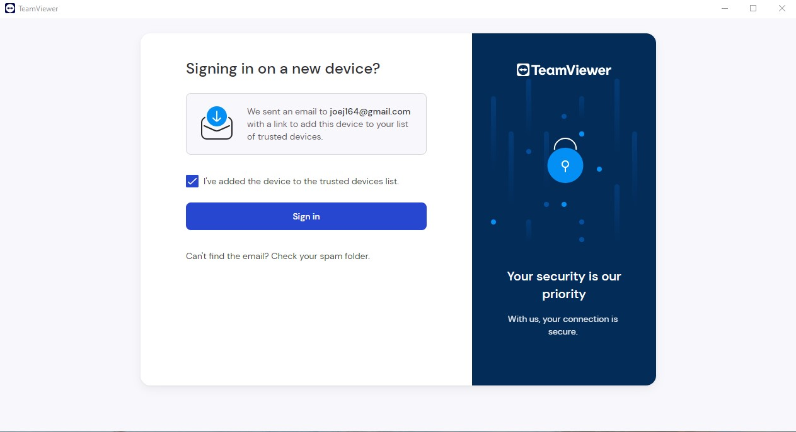

# Set up remote management
The installer didn't actually set up the machine for remote control, so to actually set up the device to be remotely managed, follow the steps in this section.

Click the second icon down from the top to bring up the devices screen
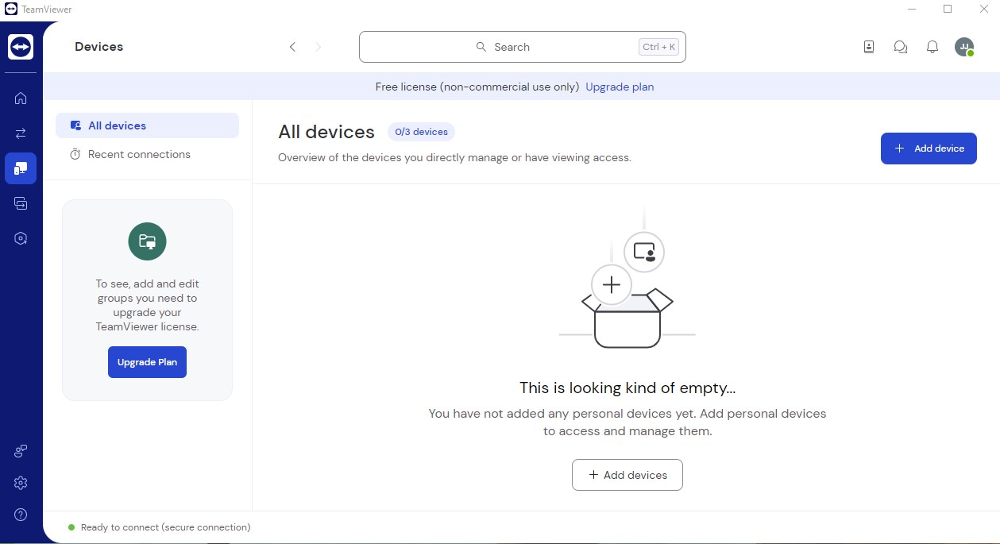
Click **Add Device**

Click *Set up remote access on this device* and click **Continue**
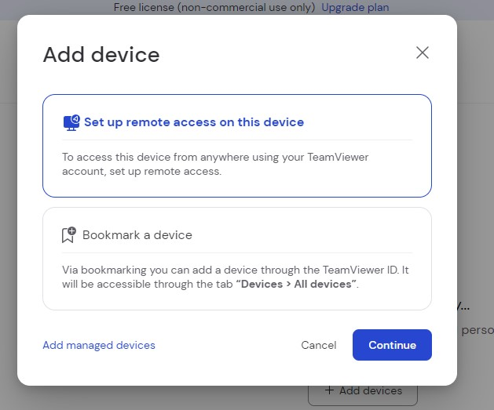

On the *Confirm device screen* click **Continue**
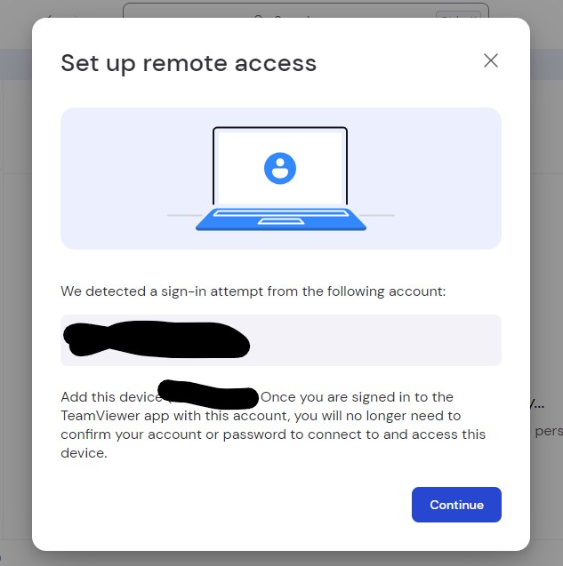

On the *Set up remote access* screen click **Assign device to my account**
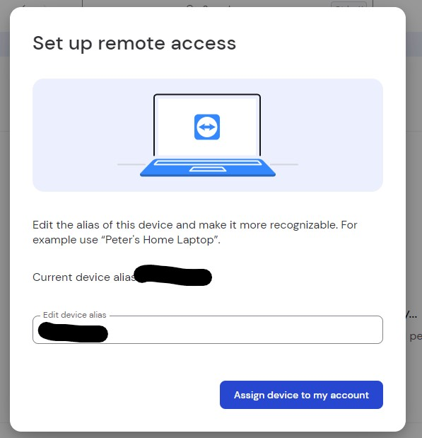

On the next screen click **Start TeamViewer with System** button.
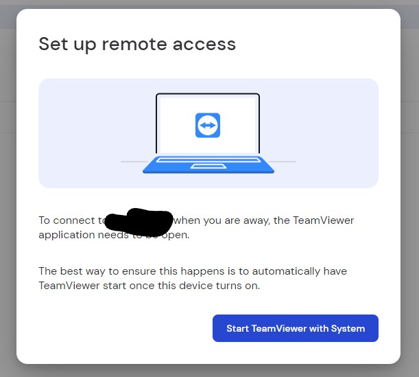

NOTE: This will cause team viewer to start every time you log in.  If you're concerned about other people accessing the devcie, you may want to launch the software manually when you want to remotely access it.

You finally end up with a Congratulations screen.

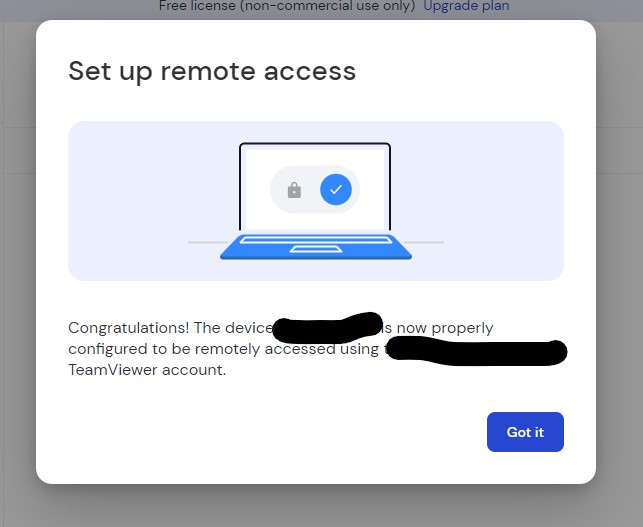